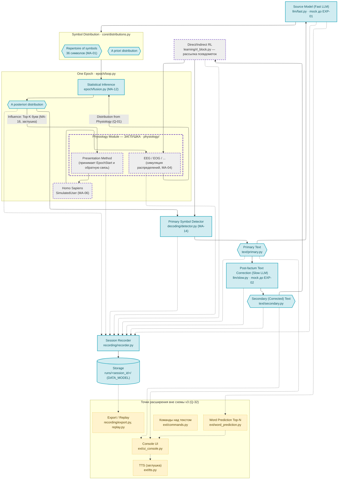
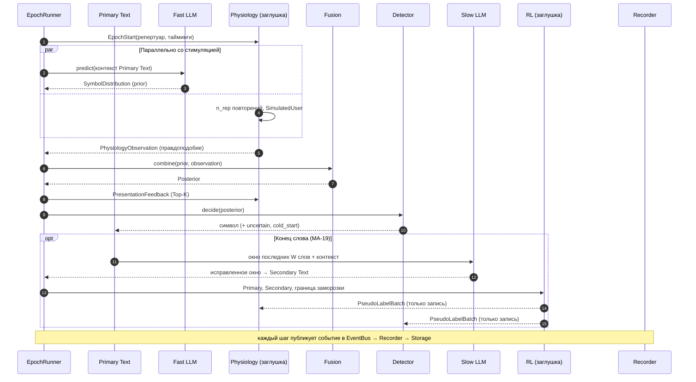

# ARCHITECTURE — архитектура прототипа ЭЭГ-спеллера с БЯМ

Версия: 1.0 от 29.09.2026. Основа — схема «Архитектура v3».
Связанные документы: `ASSUMPTIONS.md` (MA-NN, EXP-NN), `OPEN_QUESTIONS.md` (Q-NN), `DATA_MODEL.md`.

## 1. Назначение и границы прототипа

Прототип — программная реализация схемы v3 на Python, в которой:
- **реализованы** все блоки языковой и вычислительной части: Primary Text, Source Model (Fast LLM), Symbol Distribution, Statistical Inference, A posteriori distribution, Primary Symbol Detector, Post-factum Text Correction (Slow LLM), Secondary Text, Session Recorder, Storage;
- **заменены заглушками** Physiology Module (Presentation Method и EEG/EOG source) вместе с «Homo Sapiens» и блок Direct/Indirect RL. Физиологический модуль разрабатывает другая команда; от него ожидается распределение по символам за эпоху (Q-01). Пока его нет, заглушка отдаёт симулированные распределения (MA-04);
- **добавлены как точки расширения** функции ТЗ, которых нет на схеме v3 (Q-32): предсказание слов, консольный интерфейс, речевое воспроизведение, команды над текстом, экспорт и офлайн-воспроизведение.

Цель прототипа — проверить сквозной поток данных, получить инструмент для экспериментов с языковыми моделями и способами слияния и подготовить запись данных, пригодную для офлайн-оценки. Числа, полученные на симуляции, не являются проверкой требований ТЗ.

## 2. Схема v3 с разметкой статуса реализации

Узлы и связи совпадают со схемой v3; цветом показан статус в прототипе. Точки расширения вне v3 вынесены в отдельный подграф.



Легенда: голубой — реализовано; серый с фиолетовой пунктирной рамкой — заглушка; жёлтый пунктир — точка расширения вне схемы v3.

## 3. Блоки схемы и модули кода

| Блок v3 | Модуль | Интерфейс | Статус | Требования ТЗ | Допущения и вопросы |
|---|---|---|---|---|---|
| Primary Text | `text/primary.py` | `PrimaryText` | реализовано | NEED-F-01, F-05 | MA-15 |
| Source Model (Fast LLM) | `llm/fast.py`, `llm/backends/` | `FastLanguageModel` | mock + интерфейс | NEED-F-06 | MA-08, MA-09, MA-10; Q-13 |
| Symbol Distribution (RSS, APrD) | `core/distributions.py` | `SymbolDistribution` | реализовано | NEED-F-04 | MA-01, MA-02; Q-07, Q-09 |
| Presentation Method | `physiology/base.py`, `physiology/simulated.py` | `PhysiologyModule.start_epoch`, `.receive_feedback` | заглушка | NEED-F-02, F-03, REQ-CONF-01 | MA-07, MA-33; Q-06, Q-29 |
| Homo Sapiens | `physiology/simulated.py` | `SimulatedUser` | заглушка (симуляция) | — | MA-06 |
| EEG / EOG source | `physiology/simulated.py` | `PhysiologyModule.get_observation` | заглушка (симуляция) | NEED-F-04 | MA-03, MA-04, MA-05; Q-01, Q-02, Q-03 |
| Statistical Inference | `epoch/fusion.py` | `FusionStrategy` | реализовано (2 стратегии) | NEED-F-04, F-06 | MA-12, MA-13; Q-10 |
| A posteriori distribution | `core/distributions.py` | `Posterior` | реализовано | NEED-F-04 | MA-02 |
| Influence on presentation method | `epoch/presentation_feedback.py` | `PresentationFeedback` | реализовано на нашей стороне, приёмник — заглушка | — | MA-16; Q-11 |
| One Epoch | `epoch/loop.py` | `EpochRunner`, `EpochPolicy` | реализовано, только фиксированное число повторений | NEED-F-05 | MA-07; Q-04, Q-05 |
| Primary Symbol Detector | `decoding/detector.py` | `SymbolDetector` | реализовано | NEED-F-05 | MA-14, MA-15; Q-12 |
| Post-factum Text Correction (Slow LLM) | `llm/slow.py`, `llm/backends/` | `SlowLanguageModel`, `CorrectionScheduler` | mock + интерфейс | NEED-F-07 | MA-17–MA-20; Q-14–Q-17 |
| Secondary (Corrected) Text | `text/secondary.py` | `SecondaryText` | реализовано | NEED-F-07 | Q-16 |
| Direct/Indirect RL | `learning/rl_block.py`, `learning/calibration.py` | `RLBlock` | заглушка (рассылка), калибровка — опция | вне ТЗ | MA-21, MA-22; Q-18 |
| Session Recorder | `recording/recorder.py`, `core/events.py` | `EventBus`, `SessionRecorder` | реализовано | NEED-F-12, F-13 | Q-30 |
| Storage | `recording/storage.py` | `SessionStorage` | реализовано | NEED-F-12, F-14 | DATA_MODEL |

## 4. Контракты между блоками

Контракты — единственное, что блоки знают друг о друге. Все векторы упорядочены по репертуару MA-01 и хранятся как логарифмы (MA-02).

```python
# core/distributions.py
@dataclass(frozen=True)
class Repertoire:
    symbols: tuple[str, ...]            # 36 символов, порядок фиксирован (MA-01)
    layout: tuple[int, int] = (6, 6)

@dataclass(frozen=True)
class SymbolDistribution:              # блок Symbol Distribution
    repertoire: Repertoire
    log_p: np.ndarray                  # shape (36,), logsumexp = 0
    source: str                        # "fast_llm:<model_id>" | "uniform"
    context_len: int                   # длина контекста, для анализа холодного старта

@dataclass(frozen=True)
class Posterior:                       # блок A posteriori distribution
    epoch_id: int
    log_p: np.ndarray
    fusion: str                        # "log_pool" | "linear_pool"
    params: dict                       # alpha, beta, lambda

# physiology/base.py — контракт с командой физиологии (Q-01)
@dataclass(frozen=True)
class EpochStart:
    epoch_id: int
    position: int                      # номер символа в тексте
    repertoire: Repertoire             # Q-09
    paradigm: str                      # "row_column" | "single_symbol" (Q-06)
    timing: StimulusTiming             # flash_ms, isi_ms, pause_ms, n_repetitions

@dataclass(frozen=True)
class PhysiologyObservation:
    epoch_id: int
    log_p: np.ndarray                  # нормированное правдоподобие (MA-03)
    semantics: Literal["likelihood", "posterior_with_prior"]
    per_repetition: list[np.ndarray] | None = None
    stimulus_events: list[StimulusEvent] | None = None
    module_metrics: dict | None = None # например, бинарная точность (MA-23)
    t_module_ns: int | None = None     # часы внешнего модуля (Q-30)

class PhysiologyModule(Protocol):
    def start_epoch(self, msg: EpochStart) -> None: ...
    def get_observation(self) -> PhysiologyObservation: ...
    def receive_feedback(self, fb: "PresentationFeedback") -> None: ...  # стрелка Influence
    def receive_update(self, batch: "PseudoLabelBatch") -> None: ...     # стрелка от RL

# llm/fast.py
class FastLanguageModel(Protocol):
    model_id: str
    def predict(self, context: str, repertoire: Repertoire) -> SymbolDistribution: ...
    def top_words(self, context: str, n: int) -> list[tuple[str, float]]: ...  # MA-11

# epoch/fusion.py
class FusionStrategy(Protocol):
    def combine(self, prior: SymbolDistribution, obs: PhysiologyObservation) -> Posterior: ...

# epoch/presentation_feedback.py
@dataclass(frozen=True)
class PresentationFeedback:
    epoch_id: int
    decided: str
    top_k: list[tuple[str, float]]     # правило MA-16

# decoding/detector.py
@dataclass(frozen=True)
class Decision:
    epoch_id: int
    symbol: str | None                 # None — отказ (режим abstain)
    confidence: float
    margin: float
    uncertain: bool
    cold_start: bool

class SymbolDetector(Protocol):
    def decide(self, post: Posterior, position: int) -> Decision: ...
    def receive_update(self, batch: "PseudoLabelBatch") -> None: ...

# llm/slow.py
class SlowLanguageModel(Protocol):
    model_id: str
    def correct(self, left_context: str, window: list[str]) -> list[str]: ...  # MA-20

class CorrectionScheduler(Protocol):
    def on_primary_update(self, primary: str) -> "CorrectionRequest | None": ...  # MA-19

# learning/rl_block.py
@dataclass(frozen=True)
class PseudoLabel:
    epoch_id: int
    detected: str
    corrected: str
    posterior_log_p: np.ndarray

@dataclass(frozen=True)
class PseudoLabelBatch:
    labels: list[PseudoLabel]
    source_correction_id: int

class RLBlock(Protocol):
    def on_secondary_update(self, primary: str, secondary: str, frozen_upto: int) -> PseudoLabelBatch | None: ...
```

## 5. Цикл набора одного символа



Быстрая БЯМ вызывается в начале эпохи и считает prior параллельно со стимуляцией, поэтому её бюджет времени — длительность эпохи (MA-08). В симуляции время виртуальное (MA-07), параллельность моделируется метками времени.

## 6. Режимы работы

| Режим | Источник физиологии | Время | Назначение |
|---|---|---|---|
| `simulate` (по умолчанию) | `simulated` (MA-04) | виртуальное | отладка, EXP-01…08 |
| `replay` | записанные `PhysiologyObservation` из сессии | виртуальное | офлайн-оценка других настроек языковой части и слияния на тех же данных (NEED-M-01) |
| `semi_synthetic` | реальные профили из датасетов (Q-02) | виртуальное | следующая итерация, интерфейс заложен |
| `live` | реальный модуль команды физиологии | реальное | следующая итерация |

Независимо от режима: `mode.llm: on | off` задаёт условие «с БЯМ / без БЯМ» (MA-13), `stimulus.paradigm` — парадигму (Q-06).

В режиме `replay` повторно используются только наблюдения физиологии; быстрая БЯМ, слияние, детектор и коррекция пересчитываются. Если новый детектор выбирает другой символ, контекст БЯМ расходится с записанным; наблюдения при этом берутся по номеру позиции и целевому символу (в симуляции цель известна). Это ограничение офлайн-оценки фиксируется в отчёте.

## 7. Время и синхронизация

- Единые часы — `core/clock.py`: в режиме `live` — `time.monotonic_ns()`, в остальных — виртуальные часы, продвигаемые моделью MA-07.
- Каждое событие получает метку `t_ns` и сквозной номер `seq` (DATA_MODEL).
- Задержки вычислительных шагов (вызовы БЯМ, слияние) дополнительно измеряются реальными часами и пишутся в поле `wall_latency_ms` даже в виртуальном режиме — это нужно для Q-27 и EXP-01.
- Согласование с часами внешнего физиологического модуля — Q-30.

## 8. Точки расширения вне схемы v3

| Функция | Модуль | Что реализовано | Требование | Вопрос |
|---|---|---|---|---|
| Предсказание слов Top-N | `ext/word_prediction.py` | расчёт, запись, показ в UI | NEED-F-08, REQ-LLM-03 | Q-08 |
| Интерфейс участника и оператора | `ext/ui_console.py` | консольный вывод Primary/Secondary Text, кандидатов, статуса | NEED-F-09 | Q-31 |
| Речевое воспроизведение | `ext/tts.py` | интерфейс `TTSEngine`, заглушка фиксирует моменты получения строки и «старта аудио» | NEED-F-10, REQ-AUDIO-01 | Q-28 |
| Команды над текстом | `ext/commands.py` | интерфейс, заглушка «сохранить/отправить» пишет событие | NEED-F-09 | Q-07 |
| Профиль пользователя и сессии | `core/config.py` | YAML-профили, снимок в запись | NEED-F-11 | — |
| Экспорт | `recording/export.py` | пакет данных и метаданных | NEED-F-14 | — |
| Офлайн-воспроизведение | `recording/replay.py` | режим `replay` | NEED-M-01 | — |

## 9. Структура пакета

```
eeg_speller/
  core/        config.py, clock.py, events.py, distributions.py, rng.py
  text/        primary.py, secondary.py, normalize.py
  llm/         fast.py, slow.py, char_marginal.py
    backends/  mock_ngram.py, mock_correction.py, hf_causal.py, openai_compat.py
  physiology/  base.py, registry.py, simulated.py, stub_live.py
  epoch/       loop.py, fusion.py, presentation_feedback.py
  decoding/    detector.py
  learning/    rl_block.py, calibration.py
  recording/   recorder.py, storage.py, export.py, replay.py
  evaluation/  metrics.py, stats.py, experiment.py
  ext/         word_prediction.py, ui_console.py, tts.py, commands.py
  __main__.py  run | replay | export | experiment
configs/       default.yaml, no_llm.yaml, compare_llm.yaml
prompts/       correction.txt
data/          corpus_ru.txt, tasks_ru.txt
scripts/       check_markers.py, gen_data_model.py
tests/
docs/          ARCHITECTURE.md, ASSUMPTIONS.md, OPEN_QUESTIONS.md, DATA_MODEL.md, TRACEABILITY.md, REPORT_NOTES.md
```

## 10. Стандартные решения (BASE)

Эти решения не влияют на результаты экспериментов и не маркируются в коде.

- Python 3.11+, зависимости: `numpy`, `pydantic` v2, `pyyaml`, `pytest`; опционально `transformers`/`torch`, OpenAI-совместимый HTTP-клиент, `pyarrow`.
- Конфигурация — YAML, валидируется моделями pydantic; полный снимок конфига пишется в каждую сессию.
- Интерфейсы блоков — `typing.Protocol`; реализации выбираются по имени через реестры.
- Внутренняя шина событий (publish/subscribe в одном процессе); Recorder — подписчик.
- Воспроизводимость — единый `numpy.random.Generator` с сидом из конфига; дочерние генераторы на каждый блок.
- Идентификаторы и комментарии в коде — на английском, документация — на русском.
- Маркировка решений в коде: `# ASSUMPTION[MA-NN]`, `# STUB[Q-NN]`, `# IMPROV[Q-NN]`; `scripts/check_markers.py` сверяет ID в коде с этой документацией.
